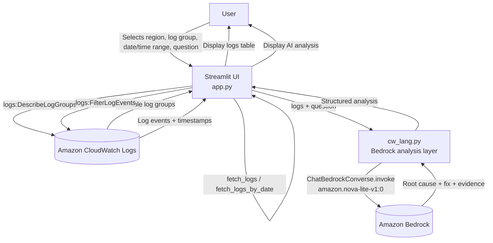

# Bedrock CloudWatch Log Analyzer

A Streamlit app that fetches AWS CloudWatch Logs and uses Amazon Bedrock
(via LangChain) to analyze them and answer natural-language questions
about errors and root causes.

## Architecture Flow



## Components

- **`app.py`** — Streamlit UI + CloudWatch integration layer (`boto3`)
  in one file. Lists log groups (`list_log_groups`) and fetches log
  events either by relative hours (`fetch_logs`) or by a specific
  calendar date (`fetch_logs_by_date`). `render_ui()` builds the page
  (region, log group, time range, question), and `__main__` launches
  it under Streamlit bound to `0.0.0.0:8082` so it's reachable
  externally (e.g. from an EC2 instance).
- **`cw_lang.py`** — Bedrock/LangChain integration layer. Sends the
  fetched logs plus the user's question to `amazon.nova-lite-v1:0` via
  `ChatBedrockConverse` and returns a structured analysis (summary,
  evidence, root cause, recommended fix, confidence).


  # Setup Commands

## 1. IAM Role

Attach an IAM role to the EC2 instance with:

```bash
AdministratorAccess
```

---

## 2. Clone Repository

```bash
yum install git -y

git clone <REPOSITORY-URL>

cd <REPOSITORY-DIRECTORY>
```

---

## 3. Install Required Packages

```bash
yum install python3-pip -y

curl -fsSL https://rpm.nodesource.com/setup_18.x | bash -

yum install -y nodejs

npm install -g pm2
```

---

## 4. Main Application

```bash
cd webapp

python3 -m venv venv

source venv/bin/activate

pip install --upgrade pip

pip install -r requirements.txt

python3 app.py
```

---

## 5. CloudWatch Agent and Log Group

```bash
sh user-data.sh
```

---

## 6. Bedrock UI

Open another terminal and connect to the same EC2 server.

```bash
cd <REPOSITORY-DIRECTORY>

python3 -m venv venv_bedrock

source venv_bedrock/bin/activate

pip install --upgrade pip

pip install -r requirements.txt
```

---

## 7. Start Bedrock UI with PM2

```bash
pm2 start app.py --name bedrock

pm2 status

pm2 logs bedrock
```


` (for `amazon.nova-lite-v1:0` in the selected region)
