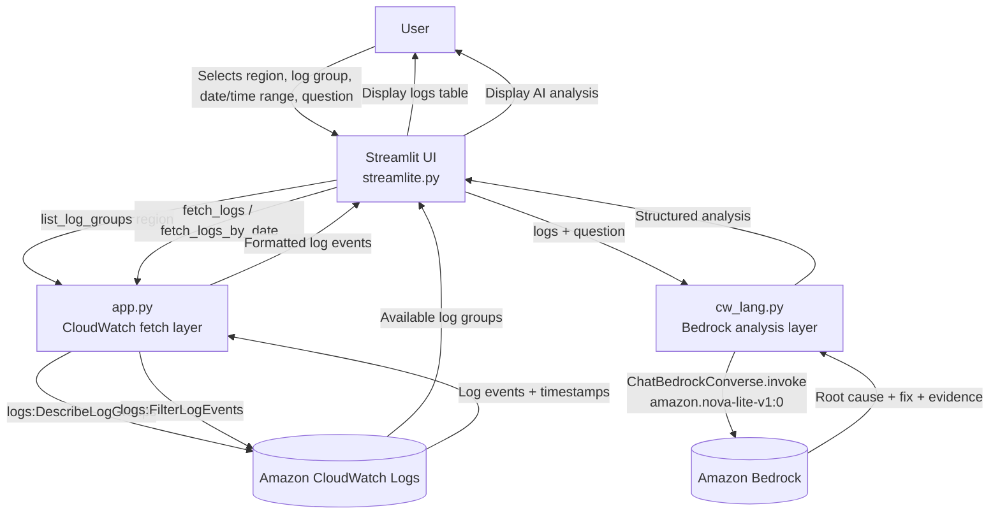

# Bedrock CloudWatch Log Analyzer

A Streamlit app that fetches AWS CloudWatch Logs and uses Amazon Bedrock
(via LangChain) to analyze them and answer natural-language questions
about errors and root causes.

## Architecture Flow



## Components

- **`streamlite.py`** — Streamlit UI. Lets the user pick a region, log
  group (auto-populated from the account), a time range (relative hours
  or a specific date), and a question to ask about the logs.
- **`app.py`** — CloudWatch integration layer (`boto3`). Lists log
  groups (`list_log_groups`) and fetches log events either by relative
  hours (`fetch_logs`) or by a specific calendar date (`fetch_logs_by_date`).
- **`cw_lang.py`** — Bedrock/LangChain integration layer. Sends the
  fetched logs plus the user's question to `amazon.nova-lite-v1:0` via
  `ChatBedrockConverse` and returns a structured analysis (summary,
  evidence, root cause, recommended fix, confidence).

## Setup

```bash
pip install -r requirements.txt
streamlit run streamlite.py
```

Requires AWS credentials configured locally (`aws configure` or
environment variables) with permissions for:
- `logs:DescribeLogGroups`
- `logs:FilterLogEvents`
- `bedrock:InvokeModel` (for `amazon.nova-lite-v1:0` in the selected region)
