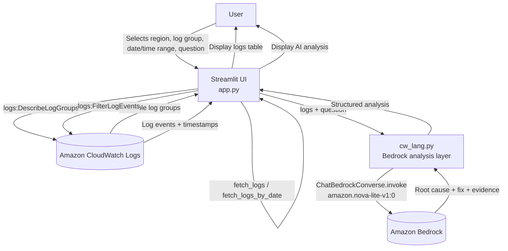

# Bedrock CloudWatch Log Analyzer

A Streamlit app that fetches AWS CloudWatch Logs and uses Amazon Bedrock
(via LangChain) to analyze them and answer natural-language questions
about errors and root causes.

## Architecture Flow



## Components

- **`app.py`** — Streamlit UI + CloudWatch integration layer (`boto3`)
  in one file. Lists log groups (`list_log_groups`) and fetches log
  events either by relative hours (`fetch_logs`) or by a specific
  calendar date (`fetch_logs_by_date`). `render_ui()` builds the page
  (region, log group, time range, question), and `__main__` launches
  it under Streamlit bound to `0.0.0.0:8082` so it's reachable
  externally (e.g. from an EC2 instance).
- **`cw_lang.py`** — Bedrock/LangChain integration layer. Sends the
  fetched logs plus the user's question to `amazon.nova-lite-v1:0` via
  `ChatBedrockConverse` and returns a structured analysis (summary,
  evidence, root cause, recommended fix, confidence).

## Setup

```bash
pip install -r requirements.txt
python app.py
```

This starts Streamlit listening on `0.0.0.0:8082`, so the UI is
reachable at `http://<host-ip>:8082`. Equivalent manual command:

```bash
streamlit run app.py --server.address 0.0.0.0 --server.port 8082
```


Requires AWS credentials configured locally (`aws configure` or
environment variables) with permissions for:
- `logs:DescribeLogGroups`
- `logs:FilterLogEvents`
- `bedrock:InvokeModel` (for `amazon.nova-lite-v1:0` in the selected region)
